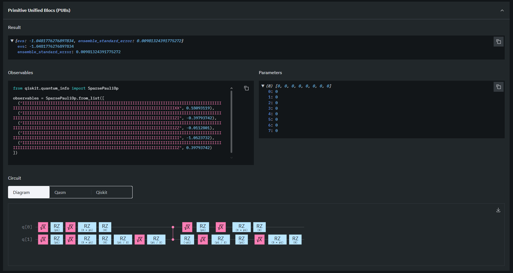

# Orbital
### Quantum Simulation MCP Server for AI Agents

Orbital is an open-source MCP (Model Context Protocol) server that gives AI agents native access to quantum computing simulations. It bridges the gap between natural language and real quantum hardware, enabling drug discovery, molecular energy calculations, and combinatorial optimization without requiring any quantum expertise from the user.

Tested with Gemini CLI and Claude Desktop. Verified on real IBM Quantum hardware.


## What is Orbital?

Most AI assistants can talk about quantum computing. Orbital lets them do it.

When an AI agent connects to Orbital, it gains four quantum tools it can invoke autonomously from a single natural language prompt. No quantum expertise required. No manual circuit design. No API wrangling.

A user says: *"Calculate the ground state energy of H2 on real quantum hardware"*

Orbital handles everything from circuit construction to IBM Quantum job submission to result parsing.


## Architecture

```
User (Natural Language)
        |
        v
AI Agent  [Gemini CLI / Claude Desktop]
        |
        |    MCP Protocol (stdio / HTTP)
        v
+-----------------------------------------------+
|               Orbital Server                  |
|                                               |
|   qc_estimate_resources                       |
|   Estimates qubits, depth, runtime,           |
|   and feasibility before execution            |
|                                               |
|   qc_simulate_qaoa                            |
|   Runs QAOA on a problem graph                |
|   Returns optimal bitstring + energy          |
|                                               |
|   qc_run_vqe                                  |
|   Local VQE simulation                        |
|   Fast, no API required                       |
|                                               |
|   qc_run_vqe_real                             |
|   Real VQE on IBM Quantum hardware            |
|   Submits actual quantum circuits             |
+-----------------------------------------------+
        |                    |
        v                    v
Local Simulator        IBM Quantum Cloud
(FastMCP + Pydantic)   (ibm_kingston, ibm_fez,
                        ibm_marrakesh)
```


## Tools

### qc_estimate_resources

Estimates the quantum resources required to run an algorithm before executing it. Returns qubit count, circuit depth, estimated runtime, fidelity score, and a FEASIBLE or NOT FEASIBLE verdict based on the target hardware.

| Input | Type | Options |
|-------|------|---------|
| algorithm | enum | QAOA, VQE, QSVM, Grover |
| problem_size | int 1-100 | Number of qubits required |
| hardware_profile | enum | ideal_simulator, noisy_simulator, ibm_eagle, ionq_aria |
| include_error_mitigation | bool | true / false |

Example prompt: *"Can a 20-qubit VQE problem run on IonQ Aria hardware?"*


### qc_simulate_qaoa

Runs a Quantum Approximate Optimization Algorithm simulation on a problem graph. Solves Max-Cut and other combinatorial optimization problems. Returns the optimal bitstring, approximation ratio, and full convergence history.

| Input | Type | Options |
|-------|------|---------|
| problem_graph | dict | nodes and weighted edges as JSON |
| p_layers | int 1-10 | Circuit depth |
| shots | int 100-10000 | Measurement shots |
| optimizer | enum | COBYLA, SPSA, L-BFGS-B |
| response_format | enum | markdown, json |

Example prompt: *"Optimize this 6-node logistics graph using QAOA with 3 layers"*


### qc_run_vqe

Local VQE simulation using mock quantum backends. Instant results. No API calls. Useful for rapid prototyping and testing before committing to real hardware.

Supported molecules: H2, LiH, BeH2, H2O, NH3

| Input | Type | Options |
|-------|------|---------|
| molecule | string | H2, LiH, BeH2, H2O, NH3 |
| basis_set | enum | sto-3g, 6-31g, cc-pvdz |
| ansatz | enum | UCCSD, HardwareEfficient, RealAmplitudes |
| max_iterations | int 10-500 | Optimizer iterations |
| shots | int 100-10000 | Measurement shots |

Example prompt: *"Simulate the ground state energy of LiH using UCCSD ansatz"*


### qc_run_vqe_real

Submits a real VQE quantum circuit to IBM Quantum hardware. Uses Qiskit Runtime with full ISA transpilation. Returns ground state energy in Hartree with hardware metadata.

Supported molecules: H2, LiH

| Input | Type | Description |
|-------|------|-------------|
| molecule | string | H2 or LiH |
| shots | int | Measurement shots (default 1000) |
| ansatz_reps | int | Ansatz repetitions (default 1) |

Example prompt: *"Run real VQE for H2 on IBM Quantum with 500 shots"*

Note: Requires IBM Quantum API token. Free plan jobs may queue for several minutes.


## Quickstart

**Clone the repository**
```bash
git clone https://github.com/sm-sayem-hossain/Orbital.git
cd Orbital
```

**Create and activate virtual environment**
```bash
python -m venv .venv

# Windows
.venv\Scripts\activate

# macOS / Linux
source .venv/bin/activate
```

**Install dependencies**
```bash
pip install fastmcp qiskit qiskit-ibm-runtime python-dotenv
```

**Configure IBM Quantum (optional, for real hardware)**

Create a `.env` file in the project root:
```
IBM_QUANTUM_TOKEN=your_api_token_here
```

Get your token at [quantum.ibm.com](https://quantum.ibm.com)

**Verify setup**
```bash
fastmcp inspect server.py
```

**Connect to Gemini CLI**
```bash
gemini mcp add orbital .venv\Scripts\python.exe server.py
gemini
```

**Try it**
```
Calculate the ground state energy of H2 molecule using VQE
```


## Hardware Verification

Orbital has been verified on real IBM Quantum hardware. The following result was obtained by submitting an actual VQE quantum circuit to ibm_kingston, a 156-qubit quantum processor located in Washington DC.



```
Backend                ibm_kingston (156 qubits)
Location               Washington DC, us-east
Algorithm              VQE with EfficientSU2 ansatz
Molecule               H2
Shots                  500
Actual QPU time        11 seconds
Total time             34 minutes 30 seconds (includes queue wait)
Ground state energy    -1.0481776276897834 Hartree
Standard error         0.00981324391775272
FCI baseline           -1.1373 Hartree
Status                 Completed
Job ID                 d7ju79i3fd4c73deh1l0
```

The energy difference from the FCI baseline is due to quantum noise and decoherence, an expected characteristic of current NISQ-era hardware.


## Project Structure

```
Orbital/
├── server.py                  # FastMCP server entry point
├── tools/
│   ├── __init__.py
│   ├── qaoa.py                # QAOA simulation, inputs, logic, formatting
│   ├── vqe.py                 # Local VQE simulation
│   └── vqe_real.py            # Real VQE via IBM Quantum Runtime
├── core/
│   ├── __init__.py
│   └── ibm_backend.py         # IBM Quantum service connection and backend selection
├── results/
│   ├── ibm_job_details.png    # IBM Quantum job dashboard screenshot
│   └── ibm_quantum_result.png # Quantum circuit and result screenshot
├── models/                    # Pydantic models (expanding)
├── tests/                     # Test suite (coming soon)
├── evals/                     # Agent evaluation Q&A pairs (coming soon)
├── .env                       # IBM Quantum token (not committed)
├── .gitignore
└── README.md
```


## Roadmap

**Phase 1 - Foundation**
Status: Complete

Working MCP server with 3 quantum tools, Gemini CLI integration, MCP Inspector verified, GitHub published.

**Phase 2 - Real Hardware**
Status: Complete

Qiskit 2.4 integration, IBM Quantum Runtime connection, real VQE job submission verified on ibm_kingston (156 qubits).

**Phase 3 - Automated Hamiltonians**
Status: In progress

PySCF and OpenFermion integration to automatically generate molecular Hamiltonians for any input molecule, removing the need for hardcoded Pauli strings.

**Phase 4 - Expanded Algorithms**
Status: Planned

Grover search, QSVM, Quantum Phase Estimation, noise modeling, error mitigation strategies.

**Phase 5 - Production**
Status: Planned

HTTP transport, token-based authentication, rate limiting, Docker deployment, cloud hosting.


## Tech Stack

| Component | Technology |
|-----------|------------|
| Language | Python 3.12 |
| MCP Framework | FastMCP 3.2.4 |
| Protocol | MCP 1.27.0 |
| Input Validation | Pydantic v2 |
| Quantum SDK | Qiskit 2.4.0 |
| Hardware Runtime | Qiskit IBM Runtime 0.46.1 |
| Quantum Hardware | IBM Quantum (ibm_kingston, ibm_fez, ibm_marrakesh) |
| Transport | stdio (local), HTTP (planned) |
| AI Clients | Gemini CLI, Claude Desktop |
| Environment | python-dotenv |


## License

MIT License. Free to use, modify, and distribute.


## Author

Sayem Hossain

Built as a demonstration of MCP server development applied to quantum computing. Contributions and issues welcome.
